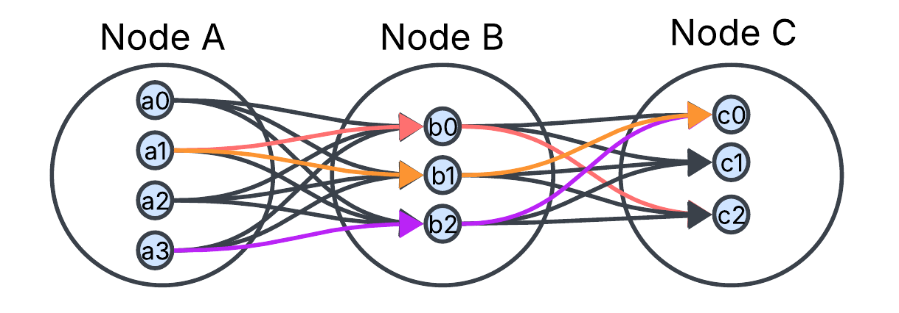

# Stochastic Topographical Mobility Analysis (STMA) in the Copenhagen Metropolitan Area  

### Matthew Papesh - March 17th, 2025

## **1.0 Overview**:

### **1.1 Introduction**: 

<span style="margin-left: 2em;">
Mobility is an area of study that focuses on how different demographics of people can move and travel within a society. Expected mobility is defined as the ease of travel an area can offer. Whether that be walkability, bike lane infrastructure, or the closeness of nearby transit stops. Mobility is also a concern for newcomers to a country. A newcomer is a person who has recently arrived to a new country, whether that be through asylum or immigration of any form and at any time. The objective of this tool is to better understand the mobility of newcomers in the Copenhagen metropolitan area of Denmark. Although newcomer mobility involves challenges, such as integrating into society, the purpose of this software is to explore specifically expected mobility. <br>
</span>

### **1.1.1 Disclaimer**:
<span style="margin-left: 2em;">
This tool requires data on movement, travel, and mobility within geographical areas. Tools, such as Google Maps, are excellent at giving travel estimates. Tools like this offer Mobility as a Service (MaaS). The STMA tool leverages the Distance Matrix AI MaaS tool. This tool offers these services on travel estimating by the Distance Matrix Application Programming Interface (API). **The Distance Matrix API was used for minimizing the monetary cost of querying data from their service. The STMA tool WILL QUERY what you ask of it. If a connection is made between two nodes with 100 sampled locations each, the STMA tool WILL QUERY TRIPS FROM 100 LOCATIONS ONTO ANOTHER 100 LOCATIONS. This will cause 10,000 trips to be evaluated. 10,000 TRIPS WILL BE REQUESTED FROM THE Distance Matrix API SERVICE and WILL be BILLED to your Distance Matrix ACCOUNT.**
</span>

<span style="margin-left: 2em;">
The STMA tool is public and open source for free use! HOWEVER, **CREATE LARGE NETWORKS AND QUERY AT YOUR OWN RISK.** Networks are not necessarily expensive, but if a large enough network is created, the STMA tool will automatically request a great amount of data from the Distance Matrix API, which may be expensive. **IT IS MY ADVICE TO CREATE A SMALL TEST NETWORK WITH YOUR Distance Matrix API ACCOUNT FIRST BEFORE TESTING WITH LARGER NETWORKS!** LASTLY, **DATA QUERIED FROM Distance Matrix API can be saved locally in your STMA project to be re-used for inferring larger trips from the smaller ones without needing to re-query, which will be more costly. 
</span>

### **1.2 Preliminary Literature**:

<span style="margin-left: 2em;">
The purpose of the <span style="font-style: italic">Stochastic Topographical Mobility Analysis</span> (STMA) tool is to sample random trips from a local geographical area. This is done by modeling movement with a graph-based approach known as <span style="font-style: italic">Individual Mobiltiy Networks</span> (IMN). An IMN describes the mobility of an individual by a graph representation of visited locations and one’s movements. This is completed by nodes representing locations with connections representing movement (Rinzivillo et al, 2014). A trip is defined as any list of connections across connected nodes. A trip can also be a single connection between two nodes. <br>
</span>
<figure style="text-align: center;">
  
  <figcaption style="font-style: italic; text-align: center;">
    Figure 1<br>
    An Example of an STMA Individual Mobility Network (IMN).
  </figcaption>
</figure>

<span style="margin-left: 2em">
 However, an IMN was modified for STMA, where each node represents a collection of locations within a local vicinity – instead of a node only representing one location. In Figure 1, nodes A, B, and C are connected, where each node has four, three, and three locations respectively. Nodes A and B are directly connected, and so are B and C. Nodes A and C are not. Seen as arrows in the figure, each connection has a set of sub-trips. Given node A has four locations and B has three, there are twelve possible sub-trips. The direct connection between nodes B and C have nine potential sub-trips. A trip is any combination of sub-trips, where at most one sub-trip is taken from each  connection. The figure shows three example trips with their sub-trips colored in red, orange, and purple. These examples show how different sub-trips can represent travel between nodes A and C. The idea of sampling sub-trips across nodes of sampled locations to understand trips taken in an area is the basis for <span style="font-style: italic">Stochastic Topographical Mobility Analysis</span> (STMA). <br>
</span>

### **1.3 Dependencies**:

<span style="margin-left: 2em;">
The STMA tool makes use of several of its own tools for estimating time and distance for trips. Other dependencies involve data scraping for GPS data on public transit stops in the Copenhagen metropolitan area. Dependencies used are mentioned below: <br>
</span>

- **Distance Matrix AI** (Distance Matrix API)
- **Nominatim OpenStreetMap** (OSM API) 
- **Overpass Turbo EU** (Overpass API) 
- **Open Data DK** 

<span style="margin-left: 2em;">
A quick description of how these tools are used is described here. Distance Matrix API served all purposes of querying time and distance data on all sub-trips sampled in an STMA IMN. Trips could then be simulated from those sub-trips. OSM API was used for reverse geocoding sampled locations. This meant, for a set of randomly sampled points for a node, OSM API found the closest meaningful location to each point. These locations became the sample of locations for that node. If a point is sampled from the harbor water of Nordhavn, or in the middle of train tracks of a train station, the locations used instead will likely be the nearby building by the harbor water or the platform of the train station by the train tracks. OSM API ensured all locations were meaningful in this way. Overpass API queried GPS data on where all Metro, S-train, and bus stops were in the Copenhagen metropolitan area for analyzing trips by these mobilities. Open Data DK was used for data on the shape of the greater Copenhagen area. If trips were to be visualized by heatmaps, Open Data DK was used to filter out points of the heatmap that fell into water and other undesirable places. This was helpful for getting heatmaps the shape of Nordhavn, Denmark. <br>
</span>

### **1.4 Scope of Use and Limitations**:

<span style="margin-left: 2em;">
This tool is useful for sampling travel mobility across different areas within a local network. Although STMA is useful in this way, STMA is not capable of providing a one-to-one model of transportation access of people within a local area. STMA is only as accurate as its own assumptions of mobility and used dependencies. STMA is useful when considering walking patterns, common travel modes, such as by car or train, and departure times for estimating expected mobility. STMA cannot capture the exact mobility of any specific demographic, and it cannot account for perceptual or sociocultural factors that can also affect mobility access of newcomers – or of any other demographic of study. The scope of use of STMA is the expected mobility that comes from the hard infrastructural factors of transportation access. <br>
</span>

## **2.0 Using the Project**:

<span style="margin-left: 2em;">
The STMA tool is a way to sample and analyze trip data within the greater Copenhagen area. This tool is a template, written in Python, that allows a user to create an IMN class for every area they intend to study. Within the IMN class, sub-trip data can be queried, trip data can be sampled, and mobilities can be visualized. Using the STMA tool is described below. <br>
</span>

<div style="page-break-after: always;"></div>

### **2.1 Mobility Node**:

<span style="margin-left: 2em;">
A mobility node is a sample of locations. It is a node within an STMA IMN, and it is also referred to as a <code>MobilityNode</code>, or <code>MNode</code>, class type in code. A <code>MobilityNode</code> takes the inputs of: transit stop GPS data, unique node name, the GPS coordinate center and radius of the node, and the number of locations to sample. There are also optional inputs that can be given. <br>
</span>

<span style="margin-left: 2em;">
After a <code>MobilityNode</code> has been created, locations can be sampled. Each location is also referred to as a <code>MobilityNode.Location</code> class type in code. Each location has details of its GPS position, region, municipality, and type in Denmark. Examples of locations types are: house, company building, bench, recreational center, and school. This allows locations to be used for analyzing mobility in tandem to understanding the kinds of places being considered. Details on how to use a <code>MobilityNode</code> are described in section <span style="font-style: italic">2.3 Mobility Network</span>. <br>
</span>

### **2.2 Mobility Connection / Profile**:

<span style="margin-left: 2em;">
A mobility connection is a sample of sub-trips between two nodes. Based on specific criteria for moving, the mobility is being profiled. For this reason, a connection is also known as a mobility profile, and it is also referred to as a <code>MobilityProfile</code>, or <code>MProfile</code>, in code. A <code>MobilityProfile</code> takes inputs of a unique name, along with the names of the two nodes that the connection will be in between. Details on how to use a <code>MobilityProfile</code> are described in section <span style="font-style: italic">2.3 Mobility Network</span>. Lastly, Distance Matrix API is used for querying sub-trips. <strong>A Distance Matrix account is needed to do this. The account online will come with an API key to use the service. The API key for the account used must be specified within the <span style="font-style: italic">mobility_profile.py</span> file, in the <code>MobilityProfile</code> class.</strong> <br>
</span>

### **2.3 Mobility Network**:

<span style="margin-left: 2em;">
An STMA IMN is a graphical model of nodes with mobility connections between them. A network is referred to as <code>MobilityNetworkBase</code> in code, and it is an inherited class type. A class should be created for each network made, where that class inherits the <code>MobilityNetworkBase</code> base class. The base class provides the STMA tools to the custom class created. The base class expects a network name to be given as input upon instantiation of the custom class object. <br>
</span>

```py
import internal.mobility_network_base import *
import matplotlib.pyplot as plt

class ExampleNetwork(MobilityNetworkBase)
  def __init__(self):
    # input name 
    super().__init__(name="example_network")

if __name__ == "__main__":
  # create network
  network = ExampleNetwork()
```

<figure style="text-align: center;"> 
  <figcaption style="font-style: italic; text-align: center;">
    Figure 2<br>
    Template code for a STMA IMN with the Name "example_network".
  </figcaption>
</figure>

<div style="page-break-after: always;"></div>

<span style="margin-left: 2em;">
As seen in Figure 2, a mobility network is created from the class type, <code>ExampleNetwork</code>, in code. The network is also given the name <span style="font-style: italic">example_network</span>. All further code will be written within the constructor function, <code>__init__()</code>. The details are further described below.<br>
</span>

### **2.3.1 Creating Nodes**:

<span style="margin-left: 2em;">
From within the network class, nodes can be created with specified inputs. Expected node inputs are: a node name, node center GPS position, node radius in kilometers, and a list of zones to avoid sampling from. Nodes can be created from sample sizes of either n=30 or n=100 locations. Locations will be sampled upon creating these nodes. A graph plotting these locations will be displayed after creating each node. The graph will need to be exited for the program to continue. This visual is helpful to show where locations are being sampled from relative to the center of the node. <br>
</span>

```py
class ExampleNetwork(MobilityNetworkBase):
  def __init__(self):
    # input name
    super().__init__(name="example_network")

    # create nodes 
    node_A = self.node_30(node_id="home", gps=(55.7099327713,12.5990828138), radius=1.0, filter_gps_zones=zones) # 30 locations sampled within 1.0 km radius from home. 
    node_B = self.node_100(node_id="inner_city", gps=(55.671570216, 12.5644029721), radius=0.75, filter_gps_zone=None) # 100 locations sampled within 0.75 km radius from the inner city. 
```

<figure style="text-align: center;">
  <figcaption style="font-style: italic; text-align: center;">
    Figure 3<br>
    Template for Creating Nodes within an STMA IMN.
  </figcaption>
</figure>

<span style="margin-left: 2em;">
As seen in Figure 3, nodes A and B are created. The size of sampled locations were 30 within a 1.0 kilometer radius and 100 locations within a 0.75 kilometer radius respectively. Node A is named <span style="font-style: italic">home</span> and B is named <span style="font-style: italic">inner_city</span>. The center GPS coordinate for each node is given as <code>gps=(latitude, longitude)</code>. A node can have zones to avoid sampling locations from. The parameter, <code>zones</code>, is a list of areas to avoid sampling from. <br>
</span>

```py
# example of zone area. 
area_1 = (x0, y0, x1, y1, x2, y2, x3, y3)
# add all areas to zone list
zones = [
  area_1, area_2, ...
]
```

<figure style="text-align: center">
  <figcaption style="font-style: italic; text-align: center;">
    Figure 4<br>
    Template List to Avoid Sampling Node Locations from. 
  </figcaption>
</figure>

<div style="page-break-after: always;"></div>

<span style="margin-left: 2em;">
Zones to avoid sampling from can be specified when sampling node locations. The <code>filter_gps_zones=zones</code> parameter, in Figure 3, is expanded upon in Figure 4. Each area specified in a zone list is a set of four GPS coordinate pairs that represent a convex parallelogram. This shaped area is avoided when sampling locations. If no zone list is given, then it is allowed to specify <code>filter_gps_zones=None</code>. <br>
</span>

### **2.3.2 Creating Connections**: 

<span style="margin-left: 2em;">
Connections can be created in a network for the mobilities of: (1) walking, (2) biking, (3) vehicle, and (4) transit. Transit mobility types are (1) bus, (2) metro, and (3) train. When creating a connection, a name is given along with the two nodes to make the connection in between. <br>
</span>

```py
# create connections 
walking = self.connection_walk(conn_id="walk", origin_node=node_A, dest_node=node_B)
biking = self.connection_bike(conn_id="bike", origin_node=node_A, dest_node=node_B)
# create transit connection
local_bus = self.connection_bus(conn_id="local_bus", origin_node=node_A, origin_mobility=self.connection_walk(), dest_node=node_B, dest_mobility=self.connection_walk(), bus_line=buses.all.value, 
depart_time=mp.TIMING(year=2025, month=4, day=1, hour=9, minute=0))
```

<figure style="text-align: center;">
  <figcaption style="font-style: italic; text-align: center;">
    Figure 5<br>
    Template for Creating Connections within an STMA IMN.
  </figcaption>
</figure>

<span style="margin-left: 2em;">
As seen in Figure 5, a walking and biking connection is made with the names <span style="font-style: italic">walk</span> and <span style="font-style: italic">bike</span> respectively. Both connections are made between nodes A and B. A third connection is made for transit by bus. An origin and destination mobility is given as <code>origin_mobility=self.connection_walk()</code> and <code>dest_mobility=self.connection_walk()</code>. These mobilities are how to travel to and from the bus stops for sampled trips between nodes A and B. The bus lines were specified to consider all of them at a specific time of day. This allows filtering for specific bus types and when they should be departing. There are other transit functions that take the same form as <code>self.connection_bus()</code>. These other connection functions that can be used are: <code>self.connection_automobile()</code>, <code>self.connection_metro()</code>, and <code>self.connection_train()</code>. <br>
</span>

### **2.3.3 Sub-Trip Data Querying**:

<span style="margin-left: 2em;">
Sub-trip data is imported into the mobility connections created in the network. This is done by calling the function, <code>self.QUERY()</code>, after all nodes and connections have already been created. Querying data will cause monetary charges to the Distance Matrix account used when using the API. To save this data and avoid multiple queries, <code>self.QUERY()</code> will export results to a CSV file located within the <span style="font-style: italic">network_mobility_data</span> folder. Each network queried corresponds to a nodes and connections CSV file; both named after the network that made them. If the network in Figure 3 is created, then the files: <span style="font-style: italic">example_network_nodes.csv</span> and <span style="font-style: italic">example_network_connections.csv</span> will be made. <br>
</span>

<div style="page-break-after: always;"></div>

```csv
node_id,lat,lon,municipality,region,type
inner,55.7078403,12.5911685,Københavns Kommune,Region Hovedstaden,residential
inner,55.715447,12.604373,Københavns Kommune,Region Hovedstaden,house
inner,55.710316,12.599727,Københavns Kommune,Region Hovedstaden,house
```

<figure style="text-align: center;">
  <figcaption style="font-style: italic; text-align: center;">
    Figure 6<br>
    <span style="font-style: italic">example_network_nodes.csv</span> File Queried from an STMA IMN.
  </figcaption>
</figure>

```csv
conn_id,orig_node_id,dest_node_id,orig_lat,orig_lon,dest_lat,dest_lon,orig_index,dest_index,time_min,distance_km
walk,inner,frontier,55.7078403,12.5911685,55.7157369,12.6113569,0,0,32.0,2.4
walk,inner,frontier,55.715447,12.604373,55.7157369,12.6113569,1,0,7.0,0.5730000000000001
walk,inner,frontier,55.710316,12.599727,55.7157369,12.6113569,2,0,29.0,2.2
```

<figure style="text-align: center;">
  <figcaption style="font-style: italic; text-align: center;">
    Figure 7<br>
    <span style="font-style: italic">example_network_connections.csv</span> File Queried from an STMA IMN.
  </figcaption>
</figure>

<span style="margin-left: 2em;">
After <code>self.QUERY()</code> exports sub-trip data, the program ends. Expected results are seen in Figure 6 and Figure 7. <span style="font-style: italic">example_network_nodes.csv</span> stores location data. Each row in this example is a different location belonging to a node named <span style="font-style: italic">inner</span>. Only one node has locations stored in this example, but usually, many node locations are stored. Each column in the example  represents the data stored in the <code>MobilityNode.Location</code> class type that defines what a location is. <span style="font-style: italic">example_network_connections.csv</span> stores all sampled sub-trip data from the network. Each row in this example represents a different sub-trip. Each sub-trip is formatted with a connection name, the name of the two nodes that the movement takes place, the specific start and end GPS positions of the sub-trip, and the sub-trip estimation data. It's important to notice that the origin GPS positions in the connections file in this example shares the same locations found in the nodes file. This is because the locations found in the <span style="font-style: italic">inner</span> node are used in the estimated sub-trips. When running the STMA program again, the <code>self.READ()</code> function can be called to import these files back into the network for sampling and visualizing trips. <br>   
</span>

### **2.3.4 STMA Results**: 

<span style="margin-left: 2em;">
STMA results are taken from sampling trips across mobility connections of an STMA IMN. Trips are sampled from the collected sub-trip data from querying. This is done by calling <code>self.sample_trip()</code>. Inputs for the function are: the name of the sample, the number of trips to sample, and the list of connections to sample across. For instance, the example in Figure 1 shows three trips across three nodes. There are two connections in this example that would be the list given to <code>self.sample_trip()</code> when sampling trips from the network. The two connections in Figure 1 are between: the first and second node, and the second and third node. <br>
</span>

<div style="page-break-after: always;"></div>

```py
class ExampleNetwork(MobilityNetworkBase):
  def __init__(self):
    # input name
    super().__init__(name="example_network")

    # create nodes 
    node_A = self.node_30(node_id="home", gps=(55.7099327713,12.5990828138), radius=1.0, filter_gps_zones=zones) 
    node_B = self.node_100(node_id="inner_city", gps=(55.671570216, 12.5644029721), radius=0.75, filter_gps_zone=None)
    # create connections
    walking = self.connection_walk(conn_id="walk", origin_node=node_A, dest_node=node_B)
    local_bus = self.connection_bus(conn_id="local_bus", origin_node=node_A, origin_mobility=self.connection_walk(), dest_node=node_B, dest_mobility=self.connection_walk(), bus_line=buses.all.value, 
    depart_time=mp.TIMING(year=2025, month=4, day=1, hour=9, minute=0))

    self.READ() # read in queried sub-trip data
    # sample trips
    walk_trips = self.sample_trip(sample_id="walk", n=1000, connections=[walking])
    bus_trips = self.sample_trip(sample_id="bus", n=1000, connections=[local_bus[0], local_bus[1], local_bus[2]])
    self.WRITE_STMA() # export trip samples
```

<figure style="text-align: center;">
  <figcaption style="font-style: italic; text-align: center;">
    Figure 8<br>
    Sampling Trips for the "example_network" STMA IMN. 
  </figcaption>
</figure>

<span style="margin-left: 2em;">
In Figure 8, nodes and connections have been made. The sub-trip data has also already been queried. Running the STMA program again, <code>self.READ()</code> is called to import the sub-trip data back into the program. Trips samples for walking and taking the bus are then created. The travel happens between nodes A and B that allow for 3000 potential trips between their locations. Both trip samples will find 1000 potential trips. The <code>local_bus</code> is a list of three connections between nodes A and B. This is because the first and third connection are the travel from the bus transit stops, and the 2nd connection is the bus ride. The connections needed for sampling bus trips are all three connections from <code>local_bus</code>. This is seen as <code>connections=[local_bus[0], local_bus[1], local_bus[2]]</code>. The trip samples are then exported to a CSV file within the <span style="font-style: italic">stma_results</span> folder. The file is named after the network name. In this example, the file would be named <span style="font-style: italic">example_network_results.csv</span>. Similar to reading in sub-trip data after querying, this sample data can be imported into the program again by calling <code>self.READ_STMA()</code>. <br>
</span>

<div style="page-break-after: always;"></div>

```csv
sample_id,time_min,distance_km,location_gps_list
walk,16.0,1.2,"[(55.7088446, 12.601899), (55.7076871, 12.5876131)]"
walk,35.0,2.5,"[(55.715447, 12.604373), (55.706358, 12.581267)]"
walk,8.0,0.611,"[(55.7078403, 12.5911685), (55.711313, 12.592417)]"
bus,60.0,4.201,"[(55.715447, 12.604373), (55.7052283, 12.5905656), (55.7052283, 12.5905656), (55.7118935, 12.600259)]"
bus,96.0,7.9,"[(55.709295, 12.600466), (55.7052283, 12.5905656), (55.6985552, 12.6005174), (55.7208019, 12.6090444)]"
bus,120.0,9.8,"[(55.7159645, 12.6037297), (55.7052283, 12.5905656), (55.6985552, 12.6005174), (55.7124193, 12.6174369)]"
```

<figure style="text-align: center;">
  <figcaption style="font-style: italic; text-align: center;">
    Figure 9<br>
    <span style="font-style: italic">example_network_results.csv</span> File of Sampled Trips.
  </figcaption>
</figure>

<span style="margin-left: 2em;">
Trips sampled are exported to a results file. In Figure 9, each row in the file is a different trip. Each column gives details on a given trip. Each trip belongs to a sample named under <span style="font-style: italic">sample_id</span>. The time in minutes and distance in kilometers is estimated for a trip. Each trip is also specified under the <span style="font-style: italic">location_gps_list</span>; the list of GPS positions that model the trip. In the example, there are three records for the <span style="font-style: italic">walk</span> and <span style="font-style: italic">bus</span> trip samples that are shown with trip estimations for time and distance. The list of GPS positions for trips in the <span style="font-style: italic">walk</span> sample have only two locations. This is expected since these trips happen across only one connection. Meanwhile, the bus trips happen over three connections, as seen in Figure 8. Three sub-trips over these connections would require a trip that is four locations long. This is seen under <span style="font-style: italic">location_gps_list</span> column for trips belonging to the <span style="font-style: italic">bus</span> sample. <br>
</span>

<span style="margin-left: 2em;">
Trip samples exported can be large enough to be statistically significant. This allows the exported STMA results to be used for analyzing trips across IMNs for statistical testing to better understand expected mobility. 
</span>

### **2.3.5 Visualizing Trips**: 

<span style="margin-left: 2em;">
Trip samples can also be visualized by heatmap. This is done by importing trip samples with <code>self.READ_STMA()</code>. The function, <code>self.visualize_trips()</code>, can be called to show a heatmap of a trip sample. The expected inputs are: the name of the trip sample, the map resolution, the type of data to show, and the GPS range to view. Other inputs that are expected are: the name to give to the heatmap data, the way to aggregate, and whether or not to filter heatmap data points by the land of the Copenhagen municipality. <br>
</span>

<span style="margin-left: 2em;">
A trip is represented as its first and final GPS positions with a line drawn in between them. The color of the line can be the time, distance, or average speed of the trip. When trip lines intersect, the colors of the lines are aggregated together. This can be done by either averaging or by taking the median of the colors. With so many trips and so many projected lines, the heatmap is made up of several trip intersections at each part of the map. <br>
</span>

<div style="page-break-after: always;"></div>

```py
self.READ_STMA()
self.visualize_trips(sample_id="walk", res=3, type='time', gps_0=(55.69189552781568, 12.578077683983123), gps_1=(55.72719585189378, 12.642107401131534), heatmap_id="walk_time", aggregate_type="mean", on_cph_land=True)
```

<figure style="text-align: center;">
  <figcaption style="font-style: italic; text-align: center;">
    Figure 10<br>
    How to Visualize Sampled Trips by Heatmap.
  </figcaption>
</figure>

<span style="margin-left: 2em;">
Seen in Figure 10, STMA trip samples are imported into the program. The trips for walking are visualized by specifying trips from the <span style="font-style: italic">walk</span> trip sample. Trip time, in minutes, is the type of data visualized on the heatmap. <code>gps_0</code> and <code>gps_1</code> give a range to visualize parts of the heatmap that fall within this area. The name of the heatmap would be <span style="font-style: italic">walk_time</span>. Intersecting trips will be combined on the heatmap by means instead of medians. Then, <code>on_cph_land=True</code> specifies that the heatmap should filter out parts that are not in the Copenhagen municipality. This includes filtering out areas in water that are away from land. <br>
</span>

<span style="margin-left: 2em;">
Heatmap data is then exported to CSV files within the <span style="font-style: italic">heatmap_results</span> folder. The file is named after the heatmap visualized, and it is automatically exported. Upon exporting, the points for the heatmap are plotted on a graph to show the heatmap as well. <br>
</span>

```csv
lat,lon,time
55.7063686606877,12.581279169840544,24.092105263157894
55.70601565744692,12.582559764183511,15.666666666666666
55.7063686606877,12.582559764183511,16.0
55.706721663928484,12.582559764183511,15.0
55.707074667169266,12.582559764183511,17.0
```

<figure style="text-align: center;">
  <figcaption style="font-style: italic; text-align: center;">
    Figure 11<br>
    <span style="font-style: italic">walk_time.csv</span> File of Sampled Heatmap Time.
  </figcaption>
</figure>

<figure style="text-align: center;">
  
  <figcaption style="font-style: italic; text-align: center;">
    Figure 12<br>
    An Example a Trip Time Heatmap from the <span style="font-style: italic">walk_time.csv</span> File.
  </figcaption>
</figure>

<span style="margin-left: 2em;">
The heatmap data is exported, as seen in Figure 11. Since it was trip time data that was aggregated, heatmap data points were weighted by time for color. The example of <span style="font-style: italic">walk_time.csv</span> shows how times can be interpreted at many GPS positions. In Figure 12, the data from <span style="font-style: italic">walk_time.csv</span> is shown through a third party program. This illustration shows how trip times in this area of Copenhagen become shorter towards the inner part of the peninsula. Trips, here, can be as short as four minutes. Further away from the peninsula center, the average trip time increases. Any time at a given point on the heatmap represents the average time of a trip traveling through that point. <br>
</span>

## **References**:

Rinzivillo, Salvatore, et al. *The Purpose of Motion: Learning Activities from Individual Mobility Networks*. IEEE Xplore, IEEE, 1 Oct. 2014. [https://ieeexplore.ieee.org/abstract/document/7058090](https://ieeexplore.ieee.org/abstract/document/7058090) (Accessed July 25, 2022)
